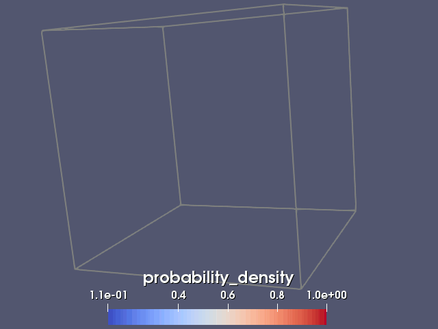
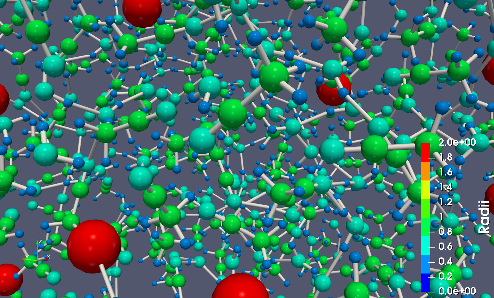
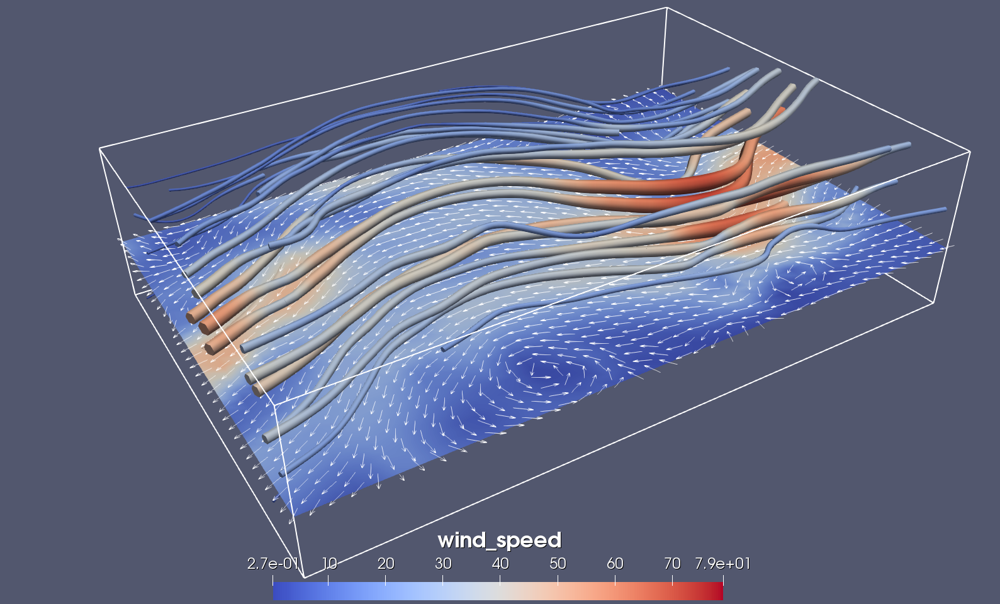

# Assignment 1 - Visualisation of various datasets

In this exercise, you will work with various datasets (micro and macro scale) in ParaView. The aim is that you should get a basic understanding of the visualisation pipeline and how data is represented. You should be able to construct basic visualisation pipelines and also control the mapping of your data (color, orientation, size, etc.).

To get a quick overview of ParaView and its GUI, we recommend that you skim through Sections 1.1-1.4, 2.1, 3.1-3.2, and 4.1 in the official ParaView Guide (available [here](https://www.paraview.org/download/)). You will find the documentation for the many filters of ParaView in Chapter 5 of the guide (for each task, we will indicate which of these filters that you should use). You might also find some of the examples from the [previous assignment](https://github.com/vetvis-uu/assignment0/) helpful.

For each part of the assignment, you should create a separate ParaView state file for your solution. In ParaView, you save the current state using File->Save state, and load a previous state using File->Load state. To avoid mixing different states, you should also do Edit->Reset session before loading a state.

Requirements to pass: Before the deadline, hand in working solutions for Parts 1-3. See the main course page for more details.

 
## Obtaining the source code and datasets

Download (or clone) the Git-repository of this assignment.

## Part 1: Isosurface extraction (Micro)

Your task is to extract and display isosurfaces of the probability density of a hydrogen atom volume dataset. The isosurfaces should be color-mapped according to the isovalue (density) and a colorbar should be available. You should also show an outline of the volume, and create a small animation that alters the isovalue and the isosurface.

To get started, go to File->Open in ParaView and select the file hydrogen.vtk that contains the vtkStructuredPoints dataset for the atom (you can also load it by right-clicking on the Pipeline browser and selecting Open). The dataset will now appear in the window's Pipeline browser, but is not yet loaded. To actually load the data, press the Apply button under Properties. The volume should now appear as an outline in the RenderView.

### Tasks

- Extract a probability isosurface (using the Contour filter). To pass the probability scalar values to the isosurface, you may have to check the property Compute Scalars for the filter.
- Add an outline showing the extent of the full volume (using the Outline filter).
- Add a colormap (with a colorbar) that maps each probablity value to a distinct color.
- Animate the Isosurfaces property of the Contour filter (under View->Animation View) to show the isosurface for different isovalues.

## Part 2: Molecular dynamics (Micro)

The data from the simulations (provided by Daniel Spångberg) are stored in two files: atoms.csv that contains 3D coordinates and radii of a number of atoms, and connections.csv that defines how the atoms are connected to each other.

One way to visualise the molecules is to represent each atom with a sphere with a radius corresponding to the radius of the atom. Some of the atoms have quite similar radii, so to make it easier to distinguish between these we can color-map the spheres depending on their radius. Finally, the connections between the atoms can be made with cylinders.

ParaView cannot generate line segments directly from the points and indices in the two CSV files, so for the connections, we will use a Python script (generate_lines.py) to generate a vtkPolyData dataset for the lines. To run the script, open the Python shell in ParaView (View->Python shell) and click on the button Run Script. This will generate a new file lines.vtk that you can load into the pipeline.

### Tasks

- Load the atoms in CSV format and extract the atoms as points (using the Table to Points filter).
- Add a glyph for each atom so that the atom is scaled by its radius (using the Glyph filter)
- Add a colormap (with a colorbar) that maps each atom radius to a distinct color. It should be possible to easily differentiate between atoms of similar radius (hint: there is an option in ParaView to generate categorical color mappings from the data).
- Load the connections in VTK format to add connection lines between the atoms, and expand the lines into cylinders (using the Tube filter).
- Add an outline showing the extent of the dataset (using the Outline filter).    

## Part 3: Air currents (Macro)

This visualisation task is about showing the direction and speed of air currents over North America. The dataset wind.vtk is a vtkStructuredPoints dataset and contains vector data (velocities) and scalar data (speeds). There are  several ways of visualizing this, but some standard techniques are streamlines, stream particles, oriented glyphs, slice planes, etc.

### Tasks

- Add a slice plane for looking at individual wind slices (using the Slice filter).
- Add an outline that shows the extent of the volume (using the Outline filter).
- Add a colormap (with a colorbar) that maps the wind speed to a color.
- Visualise the path of the wind, as streamlines (using the Stream tracer filter). The wind speed should also be mapped on the radius of the streamlines (using the Tube filter).
- Visualise the direction of the wind. Here you can use basic arrow glyphs like in the example (using the Glyph filter), but you may also think of other solutions, such as animating the propagation of the streamlines to show the direction. 
